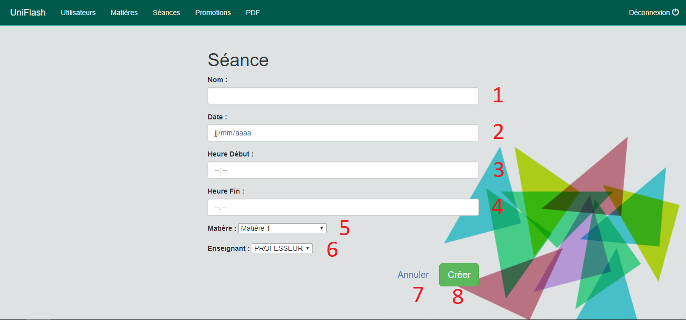

# Documentation utilisateur :

## Barre de navigation :

  

L'utilisateur du site trouvera  la barre de menu suivante sur l'intégralité des vues du site (administration). 
Cette barre permet de réalisé plusieurs action qui permettent de simplifier la navigation entre les différentes vues.
Fonction de gauche à droite :
* Bouton de retour vers l'accueil 
* Le bouton utilisateurs permet d'afficher la vue global contenant les différents utilisateurs
* Le bouton matières permet d'afficher la vue global contenant les différentes matières disponnibles
* Le bouton séances permet d'afficher la vue global contenant les différentes séances
* Le bouton promotions permet d'afficher la vue global contenant les différene promotions
* Le bouton PDF permet de séléctionner la fiche de présence que l'on souhaite afficher
* Le bouton déconnexion va permettre à l'utilisateur de se déconnecter du site

## Login :

Afin d'accéder au site, lors de chaque visite il est demandé a tout utilisateurs de bien vouloir se connecter via le nom de compte
ainsi que le mot de passe fourni par l'administration. A partir de là, tous les utilisateurs vont se retrouver sur cette vue qui 
contient les fonctionnalités suivantes :
1) Champ permettant de rentrer son nom de compte (Username)
2) Champ permettant de rentrer son mot de passe (Password)
3) Case permettant au navigateur de récupérer ses identifiants afi d'évité de les réécrire à chaque fois
4) Bouton permettant d'accéder au site et aux fonctionalités réservés aux différents utilisateurs (Etudiant, Enseignant et
Administration)

## Présentation des vues administrateurs :

L'administrateur a accès à différentes vues qui lui permette de gérer les différents éléments qui seront nécéssaire afin de renseigner  
la fiche de présence.  

Ces vues sont les suivantes :

### Vues "Utilisateurs" :

Cette vue va afficher à l'administrateur l'intégralité des utilisateurs présents danbs la base de données.
Les numéros affichés représentes les fonctionnalités disponnibles dans cette vue :
1) Affichage du "Nom',"Prénom" et "Promotion" (uniquement pour les étudiants) trié en fonction de leur rôle
2) Ici,  le bouton de gauche permet de modifier les informations d'un utilisateur. Et le second bouton permet de supprimer l'utilisateur
sélectionner ( /!\ dans l'exemple ici, le bouton est grisé car l'administrateur ne peut pas se supprimer lui même /!\ )
3) Ce bouton permet d'ajouter un utilisateur

#### Modification d'un utilisateur :

Cette interface va nous donner la possibilité de modifier les informations liées à un utilisateur :
1) Modification du Nom 
2) Modification du Prénom 
3) Modification de l'adresse e-mail
4) Sélection de la promotion
5) Bouton permettant d'annuler les modifications
6) Bouton permettant d'appliquer les modifications apportées 

#### Création d'un utilisateur :

Cette interface nous donne la possibilité de créer un compte utilisateur :
1) Création du Nom 
2) Création du Prénom 
3) Création de l'adresse e-mail
4) Sélection du role de l'utilisateur (Choix entre "Etudiant", "Enseignant" et "Administration")
5) Sélection de la promotion
6) Bouton permettant d'annuler les modifications
7) Bouton permettant de créer l'utilisateur

### Vues "Matières" :

Cette vue va afficher à l'administrateur l'intégralité des matières présentes dans la base de données.
Les numéros affichés représentes les fonctionnalités disponnibles dans cette vue :
1) Affichage des matières qui sont triées par promotion
2) * Bouton bleu : permet de modifier une matière
   * Bouton Rouge : permet de supprimer une matière
3) Bouton permettant de créer une nouvelle matière

#### Modification d'une matière :

Dans cette vue, l'administrateur va pourvoir modifier les caractéristiques d'une matière, en particulier son nom 
et la promotion auquelle elle est rattaché :
1) Champ de modification du nom de la matière
2) Selection de la promotion associé
3) Bouton permettant d'annuler la modification
4) Bouton permettant d'appliquer la modification apporté

#### Création d'une matière :

Cette interface va permettre a l'administrateur de créer et d'associer une matière a une promotion en particulier :
1) Champ de création du nom de la matière 
2) Selecteur permettant de relier une matière a une promotion
3) Bouton permettant d'annuler l'action en cours
4) Bouton permettant de créer la matière 

### Vues "Séances" :

Cette vue générale des séances va afficher à l'administrateur la totalité des séances comprises dans la base de données.
L'utilisateur va aussi pouvoir intéragir avec en réalisant 3 actions sur ces séances :
1) Voir les détails de la séance qui sera classé par matière (on peut donc se référer au nom de la matière), connaitre la date ainsi que 
la plage horraire utilisé et enfin il pourra consulter l'état de la séance (Validé ou non)
2) Grâce aux deux boutons présent ici il pourra modifier une séance en cliquant sur le bouton bleu ou il pourra la supprimer en cliquant 
sur le rouge
3) Enfin, l'administrateur connecté aura la possibilité de créer une nouvelle séance en cliquant sur le bouton "+"

#### Modification d'une séance :

[...]

#### Création d'une séance :

L'administrateur a la possibilité de de créer une nouvelle séance, pour cela il doit passer par cette vue qui lui donne accès aux 
fonctionnalités suivantes :
1) Créer un nom de séance
2) Indiquer la date exact en format jour/mois/année
3) Indiquer l'heure de début de la séance
4) Indiquer l'heure de fin de la séance
5) Séléctionner la matière associé
6) Séléctionner l'enseignant qui fera cette séance
7) Bouton permettant d'annuler l'action en cours
8) Bouton permettant de créer la séance

### Vues "Promotions" :

Afin de pouvoir rassembler les étudiants en une même entité et de pouvoir associé une matière à cette entité, l'administration a accès
à une vue "Promotions" qui lui permet de connaitre quelle promotion on été créé. 

1) Affichage du nom des promotions déjà créé
2) Bouton d'actions liés aux promotions déjà créé :
- En bleu, le bouton qui donne la possibilité de modifier une promotion
- En rouge, le bouton qui donne la possibilité de supprimier une promotion
3) Bouton qui permet de créer une nouvelle promotion 

#### Modification d'une promotion :

Lorsque l'utilisateur clique sur le bouton bleu il arrive sur cette vue de modification de promotion. 
Cette vue va lui permettre de modifier le nom de la promotion.

1) Champ de modification du nom de la promotion
2) Bouton permettant d'annuler les modifications
3) Bouton permettant d'appliquer les modifications apportées

#### Création d'une promotion :

Lorsque l'utilisateur clique sur le bouton vert, il arrive sur cette page de création de promotion.
Cette vue lui permettra de créer une nouvelle promotion.

1) Champ de création du nom de la promotion
2) Bouton permettant d'annuler la création en cours
3) Bouton permettant de créer la promotion

## Présentation vue Enseignant :

Lorsque l'enseignant se connecte au site, il arrive alors sur cette page des séances à valider.
Si aucune séance n'est a valider, la page sera presque vide et indiquera seulement qu'il n'y a pas de séance à valider.
Si il y a une ou plusieurs séances à valider, alors a ce moment là une vue avec un QRcode et une liste d'étudiants vont apparaître.
L'enseignant pourra donc montrer son QRcode à l'ensemble de la classe puis commenter s'il le souhaite la fiche de présence et enfin la 
valider.

1) QRcode a faire flasher par les élèves
2) Liste des étudiant contenant leurs nom, prénom et s'il sont noté présent ou non
3) Champ de commentaire 
4) Bouton permettant de valider la feuille de présence

## Présentation vue Etudiant :

Lorsqu'un étudiant se connecte, il est redirigé directement vers sa fiche de profil. De là, il peut uniquement consulter ses 
informations.

1) Bouton de déconnexion, permet de revenir à l'interface "login" 
2) Information visible par l'étudiant (Nom d'utilisateur, Nom et Prénom)
